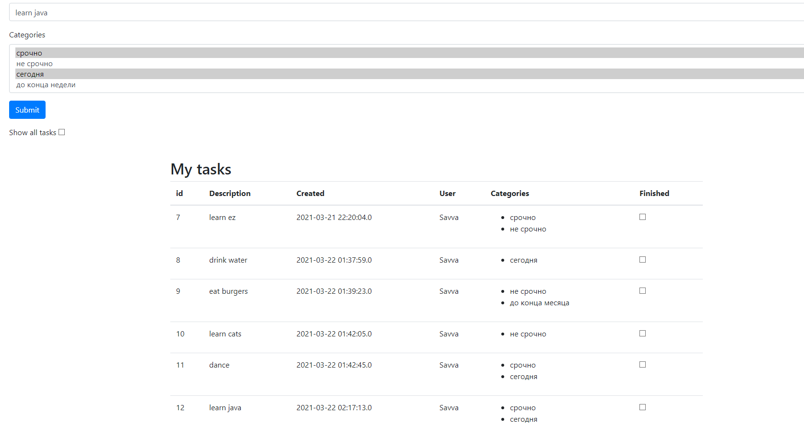
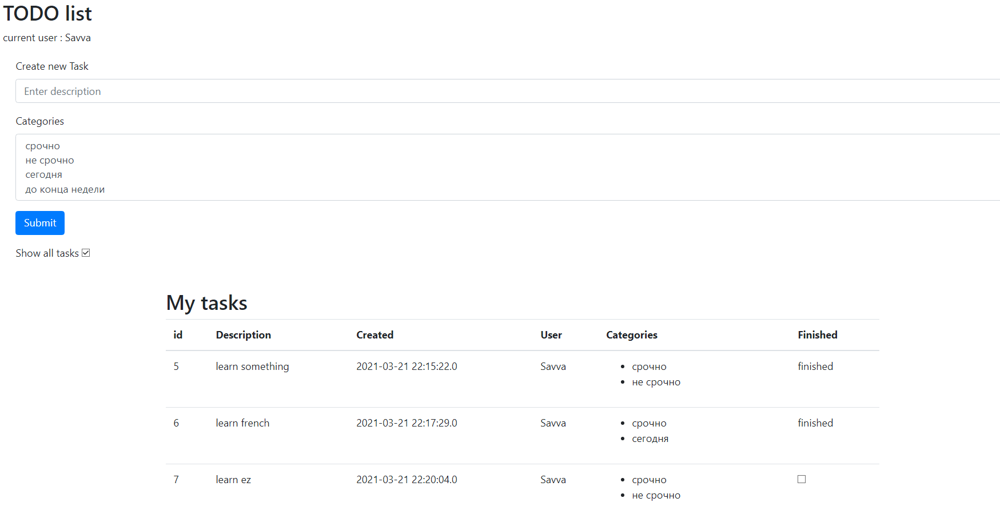
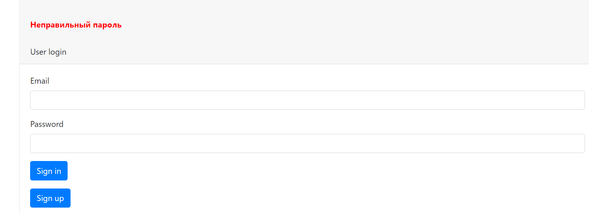
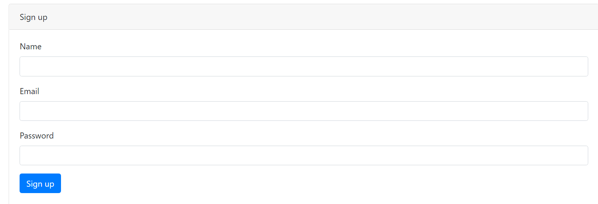

#job4j_todo

**Web Applications for TODO list**

**Technologies used:**

Java, Maven, log4j, slf4j, Servlets, Hibernate, PostgreSQL, MVC Pattern, Travis CI, HTML/CSS, JS,
jQuery, Ajax, JSON, Apache Tomcat, bootstrap

**Demonstration of the application:**

